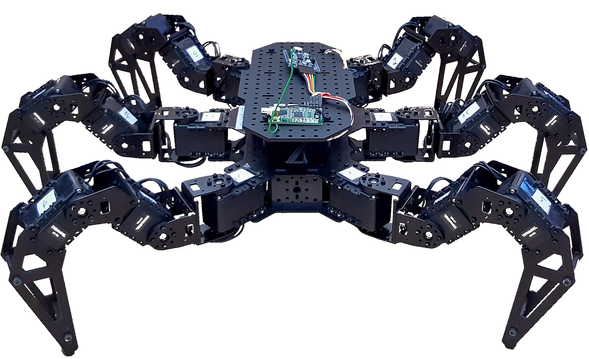
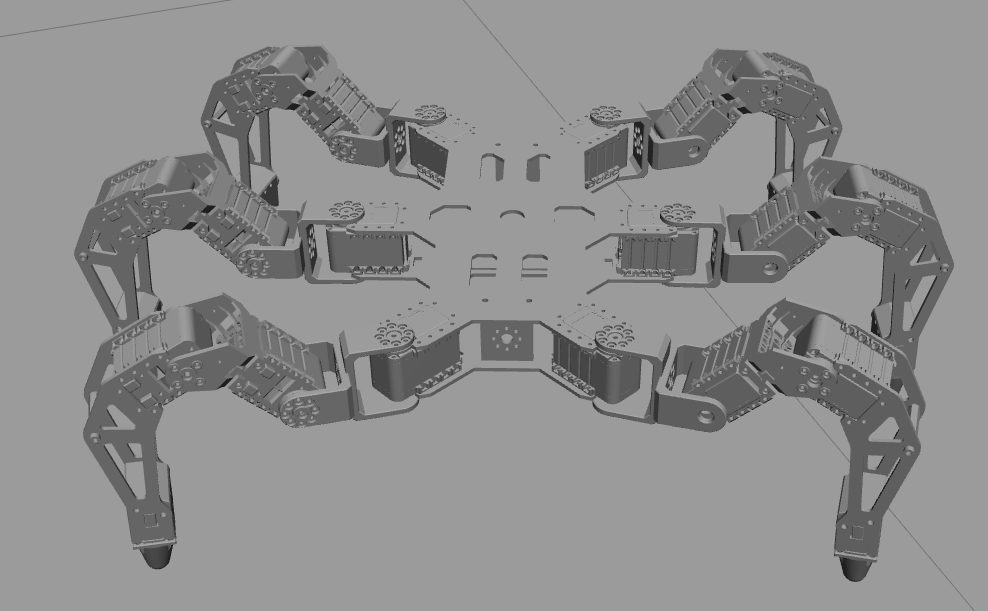

# Kognitív robotika projekt feladat 
<p align = "center">

</p>

<h1 align="center" style="margin-top: 0px;">Budapesti Műszaki és Gazdaságtudományi Egyetem </h1>

<h2 align="center" style="margin-top: 0px;">Gépészmérnöki Kar</h2>
<h3 align="center" style="margin-top: 0px;">Mechatronika, Optika és Gépészeti Informatika Tanszék</h3>

<br/><br/>

<h2 align="center" style="margin-top: 0px;">Harkó Csanád</h2>

<br/><br/><br/>

<p align = "center">2023. május 24.</p>
<br/><br/><br/>
</p>

# Tartalomjegyzék
1. [Bevezető](#1-bevezető)

    1.1. [PahntomX Mark III Hexapod](#pahntomx-mark-iii-hexapod)
2. [Telepítés](#telepítés)  
3. [A projekt felépítése](#3-a-projekt-felépítése)

    3.1. [PhantomX URDF](#31-phantomx-urdf)

    3.2. [ROS control - csomag](#32-ros-control---csomag)

    3.3. [A csuklókat vezérlő node](#33-a-csuklókat-vezérlő-node)
    
    3.3.1. [Taszító Kuramoto-modell](#331-taszító-kuramoto-modell)
4. [Futtatás](#4-futtatás)
5. [Eredmények](#5-eredmények)


# 1. Bevezető

Jelen projektfeladat a [Kognitív robotika](https://github.com/MOGI-ROS/Week-1-8-Cognitive-robotics) (BMEGEMINMKR) tárgy labor részéhez készült. A laborgyakorlatok célja a ROS-al való megbarátkozás volt, így ez a munka is, ahogyan a labor feladatok, [ROS Noetic](http://wiki.ros.org/noetic/Installation)-et használ. 

A munka során egy hatlábú robot implementálására, majd annak egy részben önszerveződő modellel való vezérlésére került sor.

## 1.1. PahntomX Mark III Hexapod

A szimuláció, egy a valóságban is létező ([PhantomX Mark III Hexapod](https://www.trossenrobotics.com/phantomx-ax-hexapod.aspx)), hatlábú lépkedő robotot használ. Ez egy kutatási célokra kifejlesztett robot, a hat láb mindegyike három csuklóval rendelkezik, melyek közül eggyel csatlakozik
a robot testéhez, így a teljes robot 18 csuklóval bír. 

A szimulációhoz használt virtuális robot modellje [URDF fájlként érhető el.](https://github.com/HumaRobotics/phantomx_description)



# 2. Telepítés

A projekt kipróbálásához ezt a git repot kell lehúzni, valamint pár ROS csomag telepítése is szükséges, melyek nem szerepelnek alapból a Noetic-ben. Ezek a következőek:

1. [ROS Control](http://wiki.ros.org/ros_control)

    A csuklók mozgatásához szükséges, a következő paranccsal lehetséges telepíteni:

    ```console
    sudo apt-get install ros-noetic-ros-control 
    ```
2. [ROS Position Controllers](http://wiki.ros.org/position_controllers)

    A csuklókat pozíció szerint vezéreljük (az eredeti, robotot leíró URDF-ben, effort controller van). Ez a csomag a `position_controllers/JointGroupPositionController` típus használata miatt szükséges, így 1 kontrollerben lehet kezelni az összes csuklót. Telepítése:
    ```console
    sudo apt-get install ros-noetic-position-controllers
    ```

# 3. A projekt felépítése

A projekt felépítése az alábbi főbb lépésekre bontható:

## 3.1. PhantomX URDF

Az URDF fájl betöltése a `/launch/phantomx_gazebo.launch` fájlban található, az üres világgal együtt. Az alábbi gif szemlélteti ekkor, hogyan vielkedik a robot, tehát szükség van, a következő fejezet alapján, egy a csuklókat vezérlő csomagra.


## 3.2. ROS control - csomag

A kontrollerhez tartozó fájlok a `/controller` mappában találhatóak. Itt vannak a csuklók implementálva és a hozzájuk tartozó PID szabályozó értékei megadva. Ezek meghívása is a fent említett launch fájlban található.

## 3.3. A csuklókat vezérlő node

A csuklókat vezérlő node a `/scripts/set_angles.py` python fájl. Ebbe van implementálva a következő fejezetben összefoglalt modell, mely a csuklókoordinátákat iterálja lépésről lépésre. A csomópont `std_msgs.msg/Float64MultiArray` típusú üzenetekként küldi a Gazebo-nak az új csuklókoordinátákat, másodpercenként 40-szer, hogy a mozgás biztosan folytonosnak tűnjön. Az egyszerűség kedvéért lábanként csak az egyik fel-le mozgásért felelős csukló van folyamatosan vezérelve, a másik a kezdőpozíciót tartja.

### 3.3.1. Taszító Kuramoto-modell

Szinkornizációs jelenségek modellezésére gyakran használunk fázisoszcillátorokat. Szinkronizáció alatt jelen esetben olyan jelenségeket értünk, amely során csatolt oszcillátorok fázisai között kialakul egy időben állandó fáziskülönbség. A hatlábú robot vezérléséhez 6 darab csatolt fázisoszcillátorból álló taszító Kuramoto-
rendszert alkalmazunk. A 6 rotátor egy-egy lábat írányít, mind az előre-hátra mind a fel-le mozgásért felelős csuklók csuklószögei
a rotátorok fázisaiból vannak kiszámolva. Egy oszcillátort leíró egyenlet:
$$
\tau \dot\theta_i = 1 + a \cos(\theta_i) + \sum_{i\neq j}^{} K_{ij}\sin(\theta_j-\theta_i),
$$
ahol $a$ kontrollparaméter és a $\tau$ időkonstans értéke rögzített, $a = 0.3$ és $\tau = 0.9 $. 
A 6 darab oszcillátor egymáshoz csatolását a $K$ taszító csatolási mátrix írja le. Az egyenletrendszer euler módszerrel kerül megoldásra, majd a rotátorok fázisai egy előre meghatározott min-max intervallumba van átskálázva, ezek már a tényleges csuklók mozgás intervallumai.
További részletekért [ [2](#hivatkozások)]

# 4. Futtatás

A ROS Master a `roscore` paranccsal indítható el. Ezt követően a szimuláció a következő paranccsal. 
```console
roslaunch phantomx_gazebo phantomx_gazebo.launch
```
Ha minden rendben a következő üzeneteket érdemes megfigyelni:
```console
Loaded 'joint_state_controller'
Started ['joint_state_controller'] successfully
Loaded 'legs_controller'
Started ['legs_controller'] successfully
[urdf_spawner-3] process has finished cleanly
```
Ezt követően elindítható a csuklókat vezérlő node:
```console
rosrun phantomx_ros set_angles.py
```

# 5. Eredmények

A vezérlő node-ban lévő paramétereket próbálgatva az alábbihoz hasonló haladó mozgások hozhatóak létre, megfigyelhető a szinkronálódás jelensége is.


# Hivatkozások
### [1] [Robotrendszerek (BMEGEMINMRL) tárgy 9.-10. heti anyaga](https://github.com/MOGI-ROS/Week-9-10-Simple-arm)

### [2] Harkó Csanád, "Hatlábú robot kísérleti tanulmányozása: önszerveződő dinamika csatolt neuronok által", 2022
